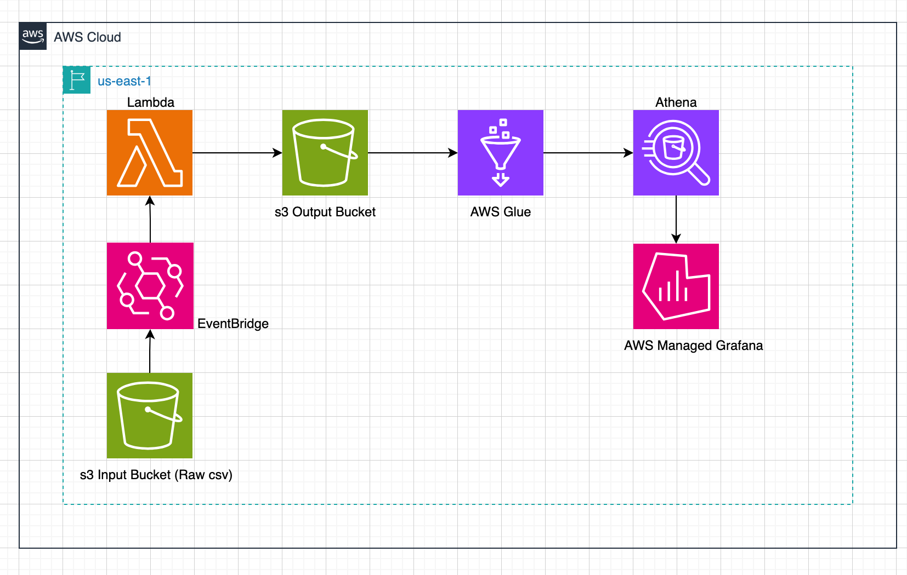

# csv-merge-pipeline

This project sets up a **serverless AWS data pipeline** that merges two CSV datasets using AWS Lambda on a scheduled basis. The merged result is stored in S3 and made queryable via Athena through Glue schema discovery.

The pipeline is designed to be cost-efficient, modular, and production-ready using Terraform.

---

## Project Purpose

This is a pilot solution for a nonprofit analyzing anxiety levels across shelters. It demonstrates how to:

- Fetch and merge two structured datasets (e.g., demographic and encounter CSVs)
- Run the pipeline automatically on a schedule (via EventBridge)
- Store cleaned output in S3
- Make that output queryable via Athena (using a Glue Crawler)
- Define all infrastructure using Terraform modules

---

## Architecture Overview



---

## Modules

- `lambda`: Deploys the merge function, IAM role, schedule, log group
- `s3`: Defines input and output buckets (raw + cleaned)

---

## Local Usage

### Requirements

- AWS CLI authenticated (`aws sts get-caller-identity`)
- Terraform v1.3+ installed
- Bash 5+, GNU coreutils

### Deploy Infrastructure

```bash
chmod +x terraform.sh
./terraform.sh dev plan
./terraform.sh dev apply
```

### Example `dev.conf`

```bash
bucket="emi-csv-merge-pipeline-dev"
key="terraform/terraform.tfstate"
region="us-east-1"
dynamodb_table="emi-csv-merge-pipeline-lock-dev"
encrypt="true"
```

---

## CI/CD

A GitHub Actions workflow is included at:

```
.github/workflows/deploy.yml
```

This workflow uses `terraform.sh` to:
- Lint and validate Terraform
- Apply infrastructure changes for each environment
- Keep local and CI workflows consistent

---

## Environment Variables for Lambda

Lambda reads these from environment variables:

- `INPUT_BUCKET` – Source bucket name
- `OUTPUT_BUCKET` – Destination bucket name
- `ANXIETY_KEY` – Key for the anxiety CSV
- `DEMOGRAPHICS_KEY` – Key for the demographics CSV
- `OUTPUT_KEY` – Key for merged output (optional)

---

## Querying the Data

Once the Glue Crawler runs, Athena can query the merged output using standard SQL:

```sql
SELECT shelter_name, anxiety_level, date
FROM merged_dataset
WHERE anxiety_level > 3
ORDER BY date DESC;
```

---

## Monitoring

- Logs are captured in CloudWatch under `/aws/lambda/<function_name>`
- Alerts can be added later via CloudWatch Alarms and SNS

---

## Refresh Logic

This pipeline uses **EventBridge** to re-run on a schedule (e.g., daily). This ensures the merged dataset stays current without relying on S3 event notifications.

---

## Assumptions

- Source files are UTF-8 encoded and follow a known schema
- `HID` matching is consistent between both datasets
- This pilot is scoped to one environment (`dev`) but is modular for expansion

---

## Next Steps (for scaling)

- Add Glue partitioning by date
- Version merged output with timestamped S3 keys
- Add retry/dead-letter config to Lambda
- CI/CD: extend to deploy Lambda code directly via GitHub Actions
